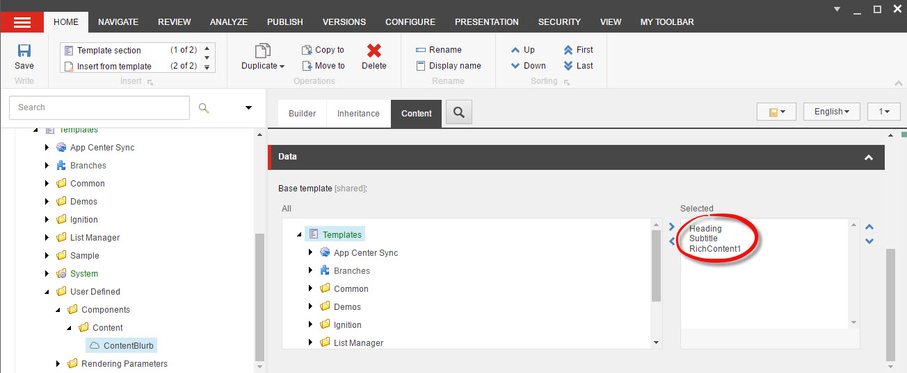

*****************
Solution Overview
*****************

.. _Ignition-Solutions:

==================
Ignition Solutions
==================

.. _Ignition-sln:

Ignition.sln
------------

.. _Ignition-tds-sln:

Ignition.Tds.sln
----------------

.. _Ignition-Core-Project:

=====================
Ignition.Core Project
=====================

.. _Adding-Additional-Fields-Definitions:

Adding Additional Fields Definitions
------------------------------------

.. _Creating-Your-Page-Structure:

Creating Your Page Structure
----------------------------

.. _Ignition-Data-Project:

=====================
Ignition.Data Project
=====================

.. _Global-Data-Structures:

Global Data Structures
----------------------

.. _Search-Page-Class-Structure:

Setting up the Search Page Class Structure
------------------------------------------

.. _Ignition-Infrastructure-Project:

===============================
Ignition.Infrastructure Project
===============================

.. _Sitecore-Computed-Fields:

Setting up Sitecore Computed Fields
-----------------------------------

.. _Token-Helper-Setup:

Setting up a Token Helper
--------------------------

.. _Ignition-Sc-Project:

===================
Ignition.Sc Project
===================

.. _Components-Folder-Structure:

Components Folder Structure
---------------------------

.. _Map-Models-Interface-to-Sitecore-Template:

Creating the Models Interface to Map to a Sitecore Template
-----------------------------------------------------------

.. _Create-ViewModel-for-Component:

Creating the ViewModel for a Component
--------------------------------------

.. _Using-the-BaseViewModel:

Using the BaseViewModel
^^^^^^^^^^^^^^^^^^^^^^^

.. _Using-the-ViewPath-Property:

Using the ViewPath Property
"""""""""""""""""""""""""""

.. _Creating-a-Custom-ViewModel:

Creating a Custom ViewModel
^^^^^^^^^^^^^^^^^^^^^^^^^^^

.. _Reusing-the-View-Model:

Re-Using the ViewModel
^^^^^^^^^^^^^^^^^^^^^^^
For most situations when the view path for a component is specified in code, it is either implied by its folder location coinciding with its controller call or directly referenced in the view model used by the view.  However, it is sometimes preferable to make a view model as re-useable as possible by multiple Sitecore component views in MVC using the ignition framework.  The view path can be set dynamically through an agent as part of the controller call so that a view model can be used by multiple separate views representing different Sitecore components.

Does that mean that a re-used view model requires the agent to change the view path as part of the controller action result?  No, as long as (a) the folder containing the controller file matches the controller cs file appendix and (b) the action result method names match the name of the views.  Then the View method call would just accept the view model and the file names and folder structure associated with the controller and views would take it from there.  As an example, what is shown below are three different controller/view calls which use the same view model *ContentBlurbViewModel*.  Note that each View call is using the same agent (ContentBlurbAgent) to help populate the ContentBlurbViewModel but each view call can use a different agent if the process used to populate that view model has to be distinct for each view call. ::

    public ActionResult ContentBlurbView()
    {
        return View<ContentBlurbAgent, ContentBlurbViewModel>();
    }

    public ActionResult ContentBlurbViewTwo()
    {
        return View<ContentBlurbAgent, ContentBlurbViewModel>();
    }

    public ActionResult ContentBlurbViewThree()
    {
        return View<ContentBlurbAgent, ContentBlurbViewModel>();
    }

In each case, the view path is not set dynamically in code because the view file name exactly matches the action result controller call and can be found in the root of the Content folder which also contains the ContentController cs file as shown below in the folder structure image.  So in this sense, the structure directly supports how the views can be accessed without requiring additional code.

.. image:: images/ContentFolderContents.jpg
    :scale: 35
    :align: center

However, if there is a need to structure the location of the view files in a different way or if the view name happens not to match the name of the action result in the controller calling it, then setting the view path dynamically in code so the view model can be re-used does become necessary.  The rest of the discussion of this blog will involve a situation where we are not assuming the view names or file locations and the action results which reference them actually match.

**View File Path Referenced through its Agent**

The view path associated with a controller call used in the Ignition framework can be set dynamically by the developer.  This would allow the same view model to be used by many different views using variations of the View method call regardless of the folder structure of the Ignition framework implementation.  An example of this call is shown below. ::

    public ActionResult HeroSelector()
    {

        return View<HeroSelectorAgent, HeroSelectorViewModel>();

    }

If a developer plans to re-use a view model and vary the view path, it will become necessary to create a view agent (please note the *HeroSelectorAgent* reference in the above example).  The agent is necessary because the view file path must be set which we will use the agent to perform.  Setting the view path on some level should be handled by the agent.   This agent must contains a PopulateMethod method which handles any logic which aids in populating the view model used for the view including where to find the view.  An example of the code used within the Populate method to set the view path is shown below.   The *IgnitionConstants.Hero.HeroSelectorView* constant references the view path.  It is encouraged to have constants defined in a constants cs file like IgnitionConstants.cs and then referenced in those files which needs access to those constants as shown. ::

    public override void PopulateModel()
    {
        ViewModel.ViewPath = IgnitionConstants.Hero.HeroSelectorView; 
    }

That is it.  With what you read you can now re-use view models with different views effectively as a part of developing re-usable content in Sitecore during component development.

.. _Creating-the-View-for-Component:

Creating the View for a Component
---------------------------------

.. _Experience-Editor-Support:

Ensuring the View Supports the Experience Editor
^^^^^^^^^^^^^^^^^^^^^^^^^^^^^^^^^^^^^^^^^^^^^^^^

.. _Creating-Experience-Editor-View:

Creating an Experience Editor View
^^^^^^^^^^^^^^^^^^^^^^^^^^^^^^^^^^

.. _Calling-the-View-Method:

Caliing the View Method
^^^^^^^^^^^^^^^^^^^^^^^
The Ignition framework contains an overridden version of the View() method which is used to not only call the view file which is to be rendered but also has a variety of options to support sophisticated logic associated with rendering the view.  The View() method full signature is defined as follows in Ignition.

return View<TAgent, TViewModel, TParams>(object agentParameters);

The View() method signature can be called in the following way which the blog below will discuss in detail.

1. View<TViewModel>()
2. View<TAgent, TViewModel>()
3. View<TAgent, TViewModel, TParams>()
4. View<TAgent, TViewModel>(agentParameters)

**View <TViewModel>() override**

The most basic View method call will only involve the view model used to render the view.  Every view method call will include the view model.  If the view model inherits Ignition’s defined fields, so no additional view model properties need defining, then the model can be passed alone.  This also assumes that the view in question needs only the base defined fields which Ignition provides out of the box.  As an example, let’s say there is a content blurb component which is utilizing an item that is inheriting the base Ignition fields provided by the framework (i.e. IHeading, ISubtitile, IRichContent1).  The model for this view is defined below. ::

    using Ignition.Core.Mvc;
    using Ignition.Data.Fields;

    namespace Ignition.Sc.Components.Content
    {
        public class ContentBlurbViewModelOnly : BaseViewModel
        {
            public IHeading Heading { get; set; }
            public ISubtitle Subtitle { get; set; }
            public IRichContent1 RichText1 { get; set; }
        }
    }

IHeading, ISubtitle and IRichContent1 are base fields defined in the Ignition.Data.Fields namespace.  Therefore, as long as the item used as a datasource for this component inherits Ignition’s Heading, Subtitle and RichContent1 templates, there will not be a need for an agent to populate the model with the content of the datasource.  An image of the Content Blurb template is shown below to show that this template inherits the Heading, Subtitle and RichContent1 templates which are base field templates in Ignition.

This simplifies the controller view call (ContentBlurbViewModelOnly) in the following manner. ::

    using System.Web.Mvc;
    using Ignition.Core.Mvc;
    using Ignition.Core.Repositories;

    namespace Ignition.Sc.Components.Content
    {
        public class ContentController : IgnitionController
        {
            public ActionResult ContentBlurbViewModelOnly()
            {
                return View<ContentBlurbViewModelOnly>();
            }  
        }
    }

This call only requires the model used to map the item used as a datasource against the component which will call this controller’s ActionResult.  In this example, the view is named ContentBlurbViewModelOnly.cshtml and resides in the same Component/Content folder as the ContentController.cs file itself.

**View<TAgent, TViewModel>() override**

The next version of the View method call will involve the agent.  The view agent is designed to provide a mechanism to complete population of the view model to properly support the rendered view.  This can prove very useful with a Sitecore site since many different items and Sitecore mechanisms can be involved with rendering a view.  This logic is coded within a view agent’s PopulateModel method which is a required method of the Agent class.  When inherited, the Agent class accepts the view model class which is used for the view.  Let’s see how the View method controller call changes when an agent is involved.  In this example, the name of the component is ContentBlurbListView.  We are using an agent named ContentBlurbListViewAgent to assist with populating the ContentBlurbListViewModel view model. ::

    using System.Web.Mvc;
    using Ignition.Core.Mvc;
    using Ignition.Core.Repositories;

    namespace Ignition.Sc.Components.Content
    {
        public class ContentController : IgnitionController
        {
            public ActionResult ContentBlurbListView()
            {
                return View<ContentBlurbListViewAgent, ContentBlurbListViewModel>();
            }  
        }
    }

The agent code is shown below.  The agent inherits the Agent class which accepts the view model class which is the same one passed through the controller call.  Each agent has a PopulateModel method which must be invoked as part of coding the agent. ::

    using Ignition.Core.Mvc;

    namespace Ignition.Sc.Components.Content
    {
        public class ContentBlurbListViewAgent : Agent<ContentBlurbListViewModel>
        {
            public override void PopulateModel()
            {
                ViewModel.ViewPath = IgnitionConstants.ContentViews.ContentBlurbListView;
            }
        }
    }

It is through this method, that the view model can be updated along with any logic needed to complete the view model passed to the view for rendering.  The ViewModel object is cast to the view model class that is referenced in the Agent class inheritance of the agent class.  In addition to having access to the properties of the view model class, the ViewModel object has access to other properties which supports rendering the view.  For instance, in the example shown, the view path of the view being rendered can be set dynamically using code like the one shown.  This option is helpful if the view is not located in the same location as the controller which ultimately calls it.  There will be other examples in this blog of how the agent’s PopulateModel method can update the view model object based on data it has access to.

**View<TAgent, TViewModel, TParams>() override**

The next version of the View method call will involve passing in rendering parameters.  Sitecore’s mechanism for rendering a component involves the ability to create and use rendering parameters to provide content authors behavioral options for rendering a component.  Using the Ignition framework, the developer would create an interface mechanism which represents in code, the rendering parameter template which would be associated with the component in Sitecore to provide those rendering options.  An example of such an interface is provided below for a ContentBlurb parameter rendering template which supports the ContentBlurb component in Sitecore. ::

    using Glass.Mapper.Sc.Configuration.Attributes;
    using Ignition.Core.Models.BaseModels;
    using Ignition.Core.Models.Settings;

    namespace Ignition.Sc.Components.Content
    {
        [SitecoreType(TemplateId = "{B85DA308-D24B-4CFC-A6BF-B7DE4C4F1B4F}", AutoMap = true)]
        public interface IContentBlurbParams : IParamsBase
        {
            IStringSetting Position { get; set; }
        }
    }

Once the interface is created, that interface referenced would be passed to the View method call to make it accessible to the view agent which will use coding logic in its PopulateModel method to access the rendering parameters available in the component. ::

    using System.Web.Mvc;
    using Ignition.Core.Mvc;
    using Ignition.Core.Repositories;

    namespace Ignition.Sc.Components.Content
    {
        public class ContentController : IgnitionController
        {
            public ActionResult ContentBlurbView()
            {
                return View<ContentBlurbAgent, ContentBlurbViewModel, IContentBlurbParams>();
            }
        }
    }

The agent example code is shown below. ::

    using Ignition.Core.Mvc;

    namespace Ignition.Sc.Components.Content
    {
        public class ContentBlurbAgent : Agent<ContentBlurbViewModel>
        {
            public override void PopulateModel()
            {
                var parameters = RenderingParameters as IContentBlurbParams;
            
                if (parameters == null) return;
                ViewModel.HeadingPosition = parameters.Position?.StringSetting;
            }
        }
    }

The PopulateModel method of the agent has access to the RenderingParameters object.  This object has access to the rendering parameter data stored in the component through the use of the rendering parameter template.  This object can be cast back to the interface which represents the rendering parameter template and can then be used to access this content when set through the component.  This content can be used by the agent to set the data which can be used by the view to influence the component’s behavior which will be ultimately driven by content authors.

**View<TAgent, TViewModel>(object agentParameters) override**

To assist with developing sophisticated logic when properly developing the view model in code, agent parameters can be defined and passed through the View method to the view agent’s PopulateModel method.  The process starts by creating an agent parameter class used to contain the data which then serves as a parameter of the View method. ::

    namespace Ignition.Sc.Components.Content
    {
        public class ContentBlurbParams
        {
            public string Params1 { get; set; }
            public string Params2 { get; set; }
            public string Params3 { get; set; }
        }
    }

Once created, the agent parameter object is instantiated and then passed to the View method.  An example of this process is shown below.  Note, the new ContentBlurbParams object passed as a parameter to the View method call. ::

    public ActionResult ContentBlurbView()
    {
        return View<ContentBlurbAgent, ContentBlurbViewModel>(new ContentBlurbParams
        {
       	    Params1 = "First Parameter",
            Params2 = "Second Parameter",
            Params3 = "Third Parameter"
        });
    }

Within the agent’s PopulateModel method, these agent parameters can be accessed using the *AgentParameters* object which can be cast to the agent parameter class used to create the object in the View method call to make accessing of the agent parameters properties much easier.  An example of this coding is shown below. ::

    using Ignition.Core.Mvc;

    namespace Ignition.Sc.Components.Content
    {
        public class ContentBlurbAgent : Agent<ContentBlurbViewModel>
        {
            public override void PopulateModel()
            {
                var agentParameters = AgentParameters as ContentBlurbParams;

                if (agentParameters == null) return;
                ViewModel.AgentParam = agentParameters.Params1;
            }
        }
    }

.. _Creating-Agent-for-Component:

Creating an Agent for a Component
----------------------------------

.. _Implementing-PopulateModel:

Implementing PopulateModel
^^^^^^^^^^^^^^^^^^^^^^^^^^

.. _Accessing-Component-Datasource:

Accessing the Component's Datasource
^^^^^^^^^^^^^^^^^^^^^^^^^^^^^^^^^^^^

.. _Setup-And-Access-Rendering-Parameters:

Setting up and Accessing Rendering Parameters
^^^^^^^^^^^^^^^^^^^^^^^^^^^^^^^^^^^^^^^^^^^^^

.. _Create-Rendering-Parameter-Template:

Creating the Rendering Parameter Template
"""""""""""""""""""""""""""""""""""""""""

.. _Code-Rendering-Parameters-Interface:

Coding the Rendering Parameters Interface
"""""""""""""""""""""""""""""""""""""""""

.. _Accessing-Rendering-Parameter-in-Code:

Accessing the Rendering Parameter in Code
"""""""""""""""""""""""""""""""""""""""""

.. _Accessing-Agent-Parameters:

Accessing the Agent Parameters
^^^^^^^^^^^^^^^^^^^^^^^^^^^^^^

.. _Search-Sitecore-Items:

Performing Searches Against Sitecore Items in Code
^^^^^^^^^^^^^^^^^^^^^^^^^^^^^^^^^^^^^^^^^^^^^^^^^^

.. _Constants-Other-Uses:

Other uses for Constants.cs
---------------------------

The Ignition framework has as a standard for using a constants file as opposed to having constants randomly assigned to variables throughout the application.  When a new Ignition project is created, an IgnitionConstants.cs file is added to the Ignition.Sc project within the Presentation folder of the Ignition solution.

Example of the type of constants oriented information which can be stored in the IgnitionConstants.cs file include

* Placeholder Names
* Folder Names
* Item Names
* Tag Names
* Item GUIDs (when needed)
* View Paths (when needed)

This is not an exhaustive list of string options for constants but keeping these constants in one file makes it easier to re-use and to update this information through-out the application when necessary.

**Code Structure of IgnitionConstants.cs File**

The code structure used to define these constants appear like the following… ::

    namespace Ignition.Sc
    {
        public struct IgnitionConstants
        {
            public struct Placeholders
            {
                public struct Layout
                {
                    public const string LayoutContent = "layoutContent";
                    public const string LayoutHead = "layoutHead";
                }

                public struct Content
                {
               	    public const string BlurbList = "blurb";
                }
            }

            public struct News
            {
                public const string NewsDetailBranchId = "{4713D2A4-6E63-4FDB-B463-6C6DA154725E}";
                public const string InTheNewsDetailBranchId = "{4CB843CE-3868-4CAE-B86F-DBDA7217E4A4}";
                public const string InTheNewsTypeTag = "InTheNews";
            }

            public struct CardTagType
            {
                public const string ContentType = "Content";
                public const string TaxonomyTag = "Tag";
            }
        }
    }

Within the IgnitionConstants class, a bunch of C# structs are used to define the level of constants needed to support the application.  An example of this reference is shown below. ::

    using Ignition.Core.Mvc;

    namespace Ignition.Sc.Components.Content
    {
        public class ContentBlurbListViewAgent : Agent<ContentBlurbListViewModel>
        {
            public override void PopulateModel()
            {
                ViewModel.CurrentTag = IgnitionConstants.CardTagType.ContentType;
            }
        }
    }

In this example, the current tag property of the view model is set by pulling a constant from the IgnitionConstants.cs file used to manage those constants where this value is defined.

.. _Create-Controller-for-Component:

Creating the Controller for a Component
----------------------------------------

.. _Using-View-Method:

Using the View<> Method
^^^^^^^^^^^^^^^^^^^^^^^

.. _Using-Only-ViewModel:

Using Only a ViewModel
""""""""""""""""""""""

.. _Using-ViewModel-and-Agent:

Using a ViewModel and Agent
"""""""""""""""""""""""""""

.. _Explicit-View-Location:

Explicit View Location
""""""""""""""""""""""

.. _Ignition-Root-Project:

=====================
Ignition.Root Project
=====================

.. _Sitecore-Configuration:

Sitecore Configuration
----------------------

.. Ignition-Tests-Project:

======================
Ignition.Tests Project
======================
