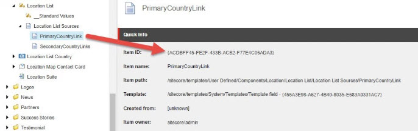

*****************
Solution Overview
*****************

.. _Ignition-Solutions:

==================
Ignition Solutions
==================

.. _Ignition-sln:

Ignition.sln
------------

.. _Ignition-tds-sln:

Ignition.Tds.sln
----------------

.. _Ignition-Core-Project:

=====================
Ignition.Core Project
=====================

.. _Adding-Additional-Fields-Definitions:

Adding Additional Fields Definitions
------------------------------------

.. _Creating-Your-Page-Structure:

Creating Your Page Structure
----------------------------

.. _Ignition-Data-Project:

=====================
Ignition.Data Project
=====================

.. _Global-Data-Structures:

Global Data Structures
----------------------

.. _Search-Page-Class-Structure:

Setting up the Search Page Class Structure
------------------------------------------

.. _Ignition-Infrastructure-Project:

===============================
Ignition.Infrastructure Project
===============================

.. _Sitecore-Computed-Fields:

Setting up Sitecore Computed Fields
-----------------------------------

.. _Token-Helper-Setup:

Setting up a Token Helper
--------------------------

.. _Ignition-Sc-Project:

===================
Ignition.Sc Project
===================

.. _Components-Folder-Structure:

Components Folder Structure
---------------------------

.. _Map-Models-Interface-to-Sitecore-Template:

Creating the Models Interface to Map to a Sitecore Template
-----------------------------------------------------------

.. _Create-ViewModel-for-Component:

Creating the ViewModel for a Component
--------------------------------------

.. _Using-the-BaseViewModel:

Using the BaseViewModel
^^^^^^^^^^^^^^^^^^^^^^^

.. _Using-the-ViewPath-Property:

Using the ViewPath Property
"""""""""""""""""""""""""""

.. _Creating-a-Custom-ViewModel:

Creating a Custom ViewModel
^^^^^^^^^^^^^^^^^^^^^^^^^^^

Sometimes, a component in Sitecore requires access to a variety of items in the content tree.  In this example, a component is created in Sitecore where the item structure was three tiered meaning that the component’s datasource, its children and grandchildren from its structure in the content tree would have to be accessed to properly populate the component.  An example of this structure is shown below where the component’s datasource is the top *Contact Location List* item.  The component in question would also access the list’s country items which are its immediate children and the list’s grandchildren which are defined as city entries which exist within the country entries.

Using the *Ignition framework*, The Location List, Location Country and the Location City were defined in the following way.  Note that the List interface defines a collection of List country interfaces and the List country interface defines a collection of List Cities and List Cities capture city information though in this case we are only interested in capturing link information to a city page. ::

    using System.Collections.Generic;
    using Common.Core.Models.Fields;
    using Glass.Mapper.Sc.Configuration;
    using Glass.Mapper.Sc.Configuration.Attributes;

    namespace Ignition.Sc.Components.Location.Models
    {
        [SitecoreType(TemplateId = "{A601C4D5-1BF3-4167-9B44-975179E292D4}", AutoMap = true)]
        public interface ILocationList : IHeading
        {
            [SitecoreField(Setting = SitecoreFieldSettings.InferType)]
            IEnumerable<ILocationListCountry> PrimaryCountryLink { get; set; }

            [SitecoreField(Setting = SitecoreFieldSettings.InferType)]
            IEnumerable<ILocationListCountry> SecondaryCountryLinks { get; set; }
        }
    }

    using System.Collections.Generic;
    using Common.Core.Models.Fields;
    using Glass.Mapper.Sc.Configuration;
    using Glass.Mapper.Sc.Configuration.Attributes;

    namespace Ignition.Sc.Components.Location.Models
    {
        [SitecoreType(TemplateId = "{DCB4BB53-3B09-4F89-BFEA-9159315212D1}", AutoMap = true)]
        public interface ILocationListCountry : IHeading
        {
            [SitecoreField(Setting = SitecoreFieldSettings.InferType)]
            IEnumerable<ILocationCity> Cities { get; set; } 
        }
    }

    using Common.Core.Models.Fields;
    using Glass.Mapper.Sc.Configuration.Attributes;

    namespace Ignition.Sc.Components.Location.Models
    {
        [SitecoreType(TemplateId = "{B86E6717-B728-460F-B013-080B52BD1413}", AutoMap = true)]
        public interface ILocationCity : IPrimaryLink
        {
        }
    }

When the view model was created for this component’s MVC view, A direct reference to the interface was used to capture information about List Country information as shown below… ::

    using System.Collections.Generic;
    using Common.Core.Models.Fields;
    using Common.Core.MVC;
    using Common.Core.Utils;
    using Ignition.Sc.Components.Location.Models;

    namespace Ignition.Sc.Components.Location.ViewModels
    {
        public class LocationListViewModel : BaseViewModel
        {
            public LocationListViewModel(IRepository repository) : base(repository)
            {
            }
            public IHeading Heading { get; set; }
       
            public ILocationListCountry PrimaryCountryModel { get; set; }
            public IEnumerable<ILocationListCountry> SecondaryCountriesModel { get; set; }
        
            public ILocationList EditFrameItem { get; set; }

            public override string ViewPath { get; set; } = Constants.Location.LocationList;
        }
    }

However, a proxy related error occurred when attempting to using this view model containing a direct reference to the *ILocationListCountry* interface.

The **PopulateModel** method used by the **Agent** interface called by the MVC controller action to access the view, performs a *mapping* between the assigned view model (passed as a parameter to the Agent interface) and the interface used to cast the component’s datasource.

It is typical using the Ignition Framework that the datasource passed to the component through Sitecore is mapped in code to an interface so the fields which make up the datasource item is automatically mapped to properties of that interface.  The interface (ILocationList) has properties representing the collection of countries (ILocationListCountry) so it made sense that the view model should have a similar property for the collection of countries so that Populate method would simply transfer the collection from the datasource to the view model.

The Agent mapping process, however, is expecting consistency when it comes to interface usage.  If an interface is directly referenced in a view model, then the interface must be referenced in or inherited by the interface being used to cast the component’s datasource.  Changing the interface in this manner is technically valid to avoid the proxy error, but then the component’s datasource interface no longer follows the template the interface is designed to be mapped to.  An example of what this update would look like for the *ILocationList* interface is shown below along with its inconsistent comparison to its original template. ::

    using System.Collections.Generic;
    using Common.Core.Models.Fields;
    using Glass.Mapper.Sc.Configuration;
    using Glass.Mapper.Sc.Configuration.Attributes;

    namespace Ignition.Sc.Components.Location.Models
    {
        [SitecoreType(TemplateId = "{A601C4D5-1BF3-4167-9B44-975179E292D4}", AutoMap = true)]
        public interface ILocationList : IHeading, ILocationListCountry
        {
            [SitecoreField(Setting = SitecoreFieldSettings.InferType)]
            IEnumerable<ILocationListCountry> PrimaryCountryLink { get; set; }

            [SitecoreField(Setting = SitecoreFieldSettings.InferType)]
            IEnumerable<ILocationListCountry> SecondaryCountryLinks { get; set; }
        }
    }

So how do we ensure that the Location List interface structure consistently reflects the template structure of the Location List in Sitecore?  Create a partial view model to replace the interface reference of the same Sitecore item and replace that property reference on the component’s view model.

The partial view model would define properties very similar to the ones defined for the interface.  In addition, there is also room to be creative if necessary through the partial view model to pass additional or customized data into the view representing the component.  For example, an added item reference property allows use of an edit frame in Sitecore’s Experience Editor within the component’s view. ::

    using System.Collections.Generic;
    using Ignition.Sc.Components.Location.Models;

    namespace Ignition.Sc.Components.Location.ViewModels
    {
        public class LocationListCountryViewModel 
        {
            public string Heading { get; set; }
            public IEnumerable<ILocationCity> Cities { get; set; }
            public ILocationListCountry EditFrameItem { get; set; }
        }
    }

Before the partial view can be used, it must be populated with the data from the interface which represents the item the agent’s view model is accessing.  A custom method was created which accepts the ILocationListCountry as a parameter and returns the partial view which is part of the component’s view model. ::

    private LocationListCountryViewModel PopulateListCountryItem(ILocationListCountry iCountry)
    {
        return new LocationListCountryViewModel
        {
     	    Heading = iCountry.Heading,
            Cities = iCountry.Cities,
            EditFrameItem = iCountry
        };
    }

Now the updated view model for this component looks like so… ::

    using System.Linq;
    using Common.Core;
    using Common.Core.MVC;
    using Common.Core.Utils;
    using Perficient.Sc.Components.Location.Models;
    using Ignition.Sc.Components.Location.ViewModels;

    namespace Ignition.Sc.Components.Location.Agents
    {
        public class LocationLocationListAgent : Agent<LocationListViewModel>
        {
            public LocationLocationListAgent(IRepository repository, SitecoreData sitecoreData) : base(repository, sitecoreData)
            {
            }

            public override void PopulateModel()
            {
                var datasource = Datasource as ILocationList;

                if (datasource == null) return;

                ViewModel.Heading = datasource;
                ViewModel.EditFrameItem = Datasource as ILocationList;
            
                ViewModel.PrimaryCountryModel = PopulateListCountryItem(datasource.PrimaryCountryLink.FirstOrDefault());
                ViewModel.SecondaryCountriesModel = datasource.SecondaryCountryLinks.Select(PopulateListCountryItem);
            }

            private LocationListCountryViewModel PopulateListCountryItem(ILocationListCountry iCountry)
            {
                return new LocationListCountryViewModel
                {
                    Heading = iCountry.Heading,
                    Cities = iCountry.Cities,
                    EditFrameItem = iCountry
                };
            }
        }
    }

Once the partial view is populated, the dependency to the interface which represents the item collection (ILocationListCountry) can now be removed since that information is provided by the partial view model instead.  As a result, the interface ILocationList now reflects the Sitecore template properly without causing the iProxy error mentioned at the beginning of this blog.

**Another Approach Not Involving Partial View Models**

There is another way to address this issue without requiring a partial view and will be convered for completeness of this topic.  We are returning to the original ILocationList interface which began the discussion of this blog as shown below. ::

    using System.Collections.Generic;
    using Common.Core.Models.Fields;
    using Glass.Mapper.Sc.Configuration;
    using Glass.Mapper.Sc.Configuration.Attributes;

    namespace Ignition.Sc.Components.Location.Models
    {
        [SitecoreType(TemplateId = "{A601C4D5-1BF3-4167-9B44-975179E292D4}", AutoMap = true)]
        public interface ILocationList : IHeading
        {
            [SitecoreField(Setting = SitecoreFieldSettings.InferType)]
            IEnumerable<ILocationListCountry> PrimaryCountryLink { get; set; }

            [SitecoreField(Setting = SitecoreFieldSettings.InferType)]
            IEnumerable<ILocationListCountry> SecondaryCountryLinks { get; set; }
        }
    }

A partial view model was used to capture the data associated with the LocationListCountry Sitecore items where the view agent converted the ILocationListCountry items into LocationListCountry partial view models, therefore there was no need to have a direct connection to the PrimaryCountryLink and SecondaryCountryLinks properties and its fields in Sitecore.

After some research, it became clear that a direct connection can be created between the Sitecore field items and the PrimaryCountryLink and SecondaryCountryLinks properties which are capturing that information in those Sitecore items.  To create that connection, the ILocationList interface needs to be updated by providing the Sitecore field IDs of the PrimaryCountryLink and SecondaryCountryLink fields from the Location List template.

Where are these GUIDs coming from ?  Just in case it was not clear, an image of the Location List template structure is provided below.  The GUIDs would come from Sitecore field items which are created when the PrimaryCountryLink and SecondaryCountryLink fields was added when the Location List template was developed.

That would have prevented the need to create a partial view.  If performed this way, the updated ILocationList interface would be coded as so… ::

    using System.Collections.Generic;
    using Common.Core.Models.Fields;
    using Glass.Mapper.Sc.Configuration;
    using Glass.Mapper.Sc.Configuration.Attributes;

    namespace Ignition.Sc.Components.Location.Models
    {
        [SitecoreType(TemplateId = "{A601C4D5-1BF3-4167-9B44-975179E292D4}", AutoMap = true)]
        public interface ILocationList : IHeading
        {
            [SitecoreField(FieldId = "{ACDBFF45-FE2F-433B-ACB2-F77E4C06ADA3}", Setting = SitecoreFieldSettings.InferType)]
            IEnumerable<ILocationListCountry> PrimaryCountryLink { get; set; }

            [SitecoreField(FieldId = "{4D4EBD74-5EC8-4F5F-81F2-87FA10CE92ED}", Setting = SitecoreFieldSettings.InferType)] 
            IEnumerable<ILocationListCountry> SecondaryCountryLinks { get; set; } 
        }    
    }

Note the FieldId attribute above both the PrimaryCountryLink and SecondaryCountryLinks interface properties which contains the GUID of each field in the LocationList Sitecore template.  Now that there is a direction connection between the Sitecore elements and the code through their GUIDs, the proxy error which appeared previously should not happen and a partial view is no longer needed to get around the original issue.

.. _Reusing-the-View-Model:

Re-Using the ViewModel
^^^^^^^^^^^^^^^^^^^^^^^
For most situations when the view path for a component is specified in code, it is either implied by its folder location coinciding with its controller call or directly referenced in the view model used by the view.  However, it is sometimes preferable to make a view model as re-useable as possible by multiple Sitecore component views in MVC using the ignition framework.  The view path can be set dynamically through an agent as part of the controller call so that a view model can be used by multiple separate views representing different Sitecore components.

Does that mean that a re-used view model requires the agent to change the view path as part of the controller action result?  No, as long as (a) the folder containing the controller file matches the controller cs file appendix and (b) the action result method names match the name of the views.  Then the View method call would just accept the view model and the file names and folder structure associated with the controller and views would take it from there.  As an example, what is shown below are three different controller/view calls which use the same view model *ContentBlurbViewModel*.  Note that each View call is using the same agent (ContentBlurbAgent) to help populate the ContentBlurbViewModel but each view call can use a different agent if the process used to populate that view model has to be distinct for each view call. ::

    public ActionResult ContentBlurbView()
    {
        return View<ContentBlurbAgent, ContentBlurbViewModel>();
    }

    public ActionResult ContentBlurbViewTwo()
    {
        return View<ContentBlurbAgent, ContentBlurbViewModel>();
    }

    public ActionResult ContentBlurbViewThree()
    {
        return View<ContentBlurbAgent, ContentBlurbViewModel>();
    }

In each case, the view path is not set dynamically in code because the view file name exactly matches the action result controller call and can be found in the root of the Content folder which also contains the ContentController cs file as shown below in the folder structure image.  So in this sense, the structure directly supports how the views can be accessed without requiring additional code.

.. image:: images/ContentFolderContents.jpg
    :scale: 35
    :align: center

However, if there is a need to structure the location of the view files in a different way or if the view name happens not to match the name of the action result in the controller calling it, then setting the view path dynamically in code so the view model can be re-used does become necessary.  The rest of the discussion of this blog will involve a situation where we are not assuming the view names or file locations and the action results which reference them actually match.

**View File Path Referenced through its Agent**

The view path associated with a controller call used in the Ignition framework can be set dynamically by the developer.  This would allow the same view model to be used by many different views using variations of the View method call regardless of the folder structure of the Ignition framework implementation.  An example of this call is shown below. ::

    public ActionResult HeroSelector()
    {

        return View<HeroSelectorAgent, HeroSelectorViewModel>();

    }

If a developer plans to re-use a view model and vary the view path, it will become necessary to create a view agent (please note the *HeroSelectorAgent* reference in the above example).  The agent is necessary because the view file path must be set which we will use the agent to perform.  Setting the view path on some level should be handled by the agent.   This agent must contains a PopulateMethod method which handles any logic which aids in populating the view model used for the view including where to find the view.  An example of the code used within the Populate method to set the view path is shown below.   The *IgnitionConstants.Hero.HeroSelectorView* constant references the view path.  It is encouraged to have constants defined in a constants cs file like IgnitionConstants.cs and then referenced in those files which needs access to those constants as shown. ::

    public override void PopulateModel()
    {
        ViewModel.ViewPath = IgnitionConstants.Hero.HeroSelectorView; 
    }

That is it.  With what you read you can now re-use view models with different views effectively as a part of developing re-usable content in Sitecore during component development.

.. _Creating-the-View-for-Component:

Creating the View for a Component
---------------------------------

.. _Experience-Editor-Support:

Ensuring the View Supports the Experience Editor
^^^^^^^^^^^^^^^^^^^^^^^^^^^^^^^^^^^^^^^^^^^^^^^^

.. _Creating-Experience-Editor-View:

Creating an Experience Editor View
^^^^^^^^^^^^^^^^^^^^^^^^^^^^^^^^^^

.. _Creating-Agent-for-Component:

Creating an Agent for a Component
----------------------------------

.. _Implementing-PopulateModel:

Implementing PopulateModel
^^^^^^^^^^^^^^^^^^^^^^^^^^

.. _Accessing-Component-Datasource:

Accessing the Component's Datasource
^^^^^^^^^^^^^^^^^^^^^^^^^^^^^^^^^^^^

.. _Setup-And-Access-Rendering-Parameters:

Setting up and Accessing Rendering Parameters
^^^^^^^^^^^^^^^^^^^^^^^^^^^^^^^^^^^^^^^^^^^^^

.. _Create-Rendering-Parameter-Template:

Creating the Rendering Parameter Template
"""""""""""""""""""""""""""""""""""""""""

.. _Code-Rendering-Parameters-Interface:

Coding the Rendering Parameters Interface
"""""""""""""""""""""""""""""""""""""""""

.. _Accessing-Rendering-Parameter-in-Code:

Accessing the Rendering Parameter in Code
"""""""""""""""""""""""""""""""""""""""""

.. _Accessing-Agent-Parameters:

Accessing the Agent Parameters
^^^^^^^^^^^^^^^^^^^^^^^^^^^^^^

.. _Search-Sitecore-Items:

Performing Searches Against Sitecore Items in Code
^^^^^^^^^^^^^^^^^^^^^^^^^^^^^^^^^^^^^^^^^^^^^^^^^^

.. _Constants-Other-Uses:

Other uses for Constants.cs
---------------------------

The Ignition framework has as a standard for using a constants file as opposed to having constants randomly assigned to variables throughout the application.  When a new Ignition project is created, an IgnitionConstants.cs file is added to the Ignition.Sc project within the Presentation folder of the Ignition solution.

Example of the type of constants oriented information which can be stored in the IgnitionConstants.cs file include

* Placeholder Names
* Folder Names
* Item Names
* Tag Names
* Item GUIDs (when needed)
* View Paths (when needed)

This is not an exhaustive list of string options for constants but keeping these constants in one file makes it easier to re-use and to update this information through-out the application when necessary.

**Code Structure of IgnitionConstants.cs File**

The code structure used to define these constants appear like the following… ::

    namespace Ignition.Sc
    {
        public struct IgnitionConstants
        {
            public struct Placeholders
            {
                public struct Layout
                {
                    public const string LayoutContent = "layoutContent";
                    public const string LayoutHead = "layoutHead";
                }

                public struct Content
                {
               	    public const string BlurbList = "blurb";
                }
            }

            public struct News
            {
                public const string NewsDetailBranchId = "{4713D2A4-6E63-4FDB-B463-6C6DA154725E}";
                public const string InTheNewsDetailBranchId = "{4CB843CE-3868-4CAE-B86F-DBDA7217E4A4}";
                public const string InTheNewsTypeTag = "InTheNews";
            }

            public struct CardTagType
            {
                public const string ContentType = "Content";
                public const string TaxonomyTag = "Tag";
            }
        }
    }

Within the IgnitionConstants class, a bunch of C# structs are used to define the level of constants needed to support the application.  An example of this reference is shown below. ::

    using Ignition.Core.Mvc;

    namespace Ignition.Sc.Components.Content
    {
        public class ContentBlurbListViewAgent : Agent<ContentBlurbListViewModel>
        {
            public override void PopulateModel()
            {
                ViewModel.CurrentTag = IgnitionConstants.CardTagType.ContentType;
            }
        }
    }

In this example, the current tag property of the view model is set by pulling a constant from the IgnitionConstants.cs file used to manage those constants where this value is defined.

.. _Create-Controller-for-Component:

Creating the Controller for a Component
----------------------------------------

.. _Using-View-Method:

Using the View<> Method
^^^^^^^^^^^^^^^^^^^^^^^

.. _Using-Only-ViewModel:

Using Only a ViewModel
""""""""""""""""""""""

.. _Using-ViewModel-and-Agent:

Using a ViewModel and Agent
"""""""""""""""""""""""""""

.. _Explicit-View-Location:

Explicit View Location
""""""""""""""""""""""

.. _Ignition-Root-Project:

=====================
Ignition.Root Project
=====================

.. _Sitecore-Configuration:

Sitecore Configuration
----------------------

.. Ignition-Tests-Project:

======================
Ignition.Tests Project
======================
